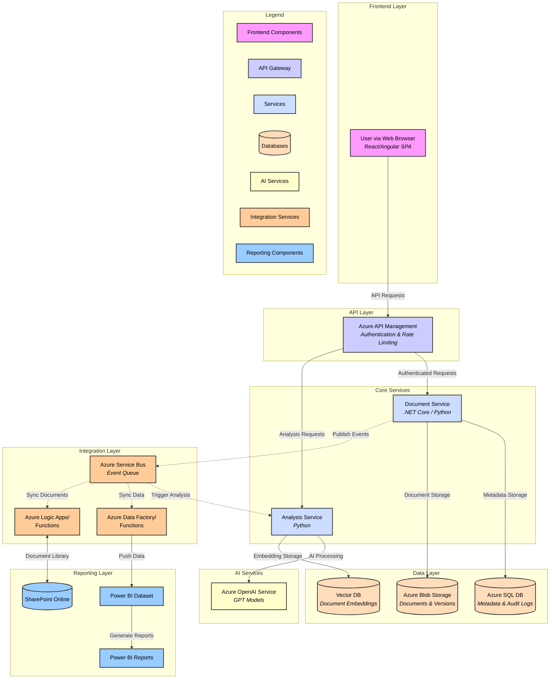
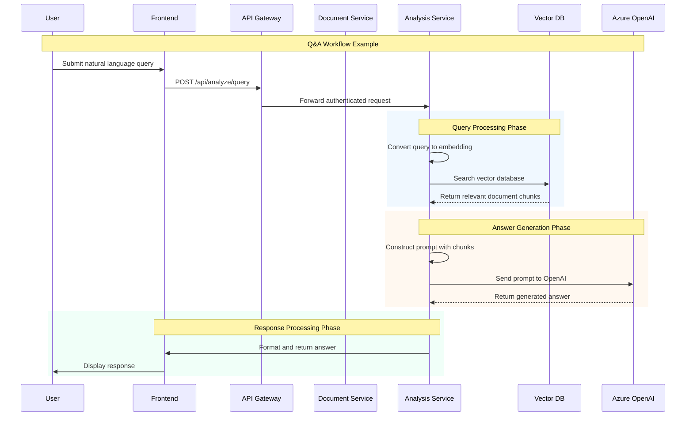

# AI-Powered Legal Document Intelligence Platform

## Technical Design Document

### Version: `1.1`

### Date: April 22, 2025

### Status: Draft

## Table of Contents

1. Introduction
2. Functional Requirements (FRD)
3. Architecture Overview
4. Detailed Design
5. Data Design
6. API Specification Overview
7. Security Design
8. Requirements Traceability
9. Non-Functional Requirements (NFRs)
10. Deployment Strategy
11. Monitoring and Logging
12. Technical Debt Register
13. Future Considerations
14. Appendix

## 1. Introduction

### 1.1 Purpose


This Technical Design Document (TDD) outlines the architecture, components, interfaces, and data design for the AI-Powered Legal Document Intelligence Platform. The platform aims to revolutionize how legal professionals interact with complex documents by leveraging artificial intelligence for analysis, workflow automation, and insight generation. This document serves as a blueprint for the development team, ensuring alignment and providing a comprehensive technical specification.
### 1.2 Goals and Objectives

- Enhance Efficiency: Significantly reduce time spent by legal teams on manual document review, analysis, and comparison
- Improve Accuracy: Minimize human error in tasks like clause identification, PII redaction, and deadline tracking
- Mitigate Risk: Ensure compliance and security through robust access controls, audit trails, and reliable data handling
- Enable Insights: Provide powerful Q&A capabilities and reporting to extract valuable information from large document sets
- Seamless Integration: Integrate smoothly with existing legal workflows and tools like Microsoft Outlook/Teams and SharePoint

### 1.3 Scope

#### In Scope:

- Secure user authentication and role-based access control
- Document upload, storage (including versioning), and management (supporting formats like PDF, DOCX)
- AI-powered natural language question-answering based on uploaded documents
- Automated extraction and classification of predefined legal clauses
- Comparison of multiple document versions or related documents, highlighting differences
- AI-assisted redaction of Personally Identifiable Information (PII) and other sensitive data
- Automated tracking of key dates and deadlines identified within documents
- Integration with Microsoft Outlook/Teams for deadline notifications
- Integration with SharePoint for document sourcing/storage (optional)
- Comprehensive audit logging of user and system actions
- Reporting dashboards via Power BI integration

#### Out of Scope:

- Providing legal advice or interpretation
- Automated contract generation or negotiation
- E-discovery case management features beyond document analysis
- Direct editing of native document formats within the platform (focus is on analysis and derived work products like redacted versions)
- Support for non-English languages (initially)

### 1.4 Assumptions and Constraints

- Cloud Platform: Solution deployed exclusively on Microsoft Azure
- AI Service: Azure OpenAI as primary provider for large language model (LLM) capabilities
- Identity Provider: Azure Active Directory (Azure AD) for user authentication
- Connectivity: Users have reliable internet connectivity
- Data Residency: Data residency requirements must be adhered to based on client location and Azure region capabilities
- Budget/Resource Constraints: Development and operational activities subject to allocated budgets and team availability

## 2. Functional Requirements (FRD)

### 2.1 Document Analysis

| Req ID | Description | Acceptance Criteria | Priority | Status | Rationale |
| --- | --- | --- | --- | --- | --- |
| FR-001 | Natural Language Q&A Interface | System responds to 90% of typical legal queries within 2 seconds (p95 latency). Answer accuracy ≥95% based on benchmark dataset. | High | Planned | Core AI feature providing significant time savings for information retrieval |
| FR-002 | Automated Clause Extraction | System correctly identifies ≥25 predefined clause types with minimum recall of 90% and precision of 85%. | High | In Progress | Automates tedious review task, standardizes clause identification |
| FR-003 | Multi-Document Comparison | Accurately identifies textual additions/deletions/modifications between compared documents. Completes comparison of two 100-page documents in <5 seconds. | Medium | Planned | Facilitates negotiation tracking and review of amendments |

### 2.2 Workflow Automation

| Req ID | Description | Acceptance Criteria | Priority | Status | Rationale |
| --- | --- | --- | --- | --- | --- |
| FR-004 | AI-Powered Redaction | System identifies and correctly redacts ≥50 PII types with 99.9% precision and 95% recall. | High | Completed | Critical for compliance (GDPR, HIPAA) and protecting sensitive data |
| FR-005 | Deadline Tracking | System identifies common date/deadline patterns with 90% accuracy. Confirmed deadlines sync with calendar events within 1 minute. | Medium | In Progress | Prevents missed deadlines and improves contract lifecycle management |
| FR-006 | Version Control | System tracks ≥100 historical versions per document. Provides interface for version history and comparison. | Medium | Planned | Ensures document integrity and traceability throughout lifecycle |

### 2.3 Security & Compliance

| Req ID | Description | Acceptance Criteria | Priority | Status | Rationale |
| --- | --- | --- | --- | --- | --- |
| FR-007 | Role-Based Access Control (RBAC) | Supports ≥5 distinct roles with configurable permissions. Integration with Azure AD for group-based role assignments. | High | Completed | Ensures only authorized personnel can access sensitive legal documents |
| FR-008 | Audit Trail | Logs include user actions, document operations, and system events. Stored securely for ≥1 year with immutable storage. | High | In Progress | Essential for security monitoring, compliance reporting, and forensic analysis |
| FR-009 | Data Encryption | AES-256 encryption at rest and TLS 1.3 in transit. Encryption keys managed via Azure Key Vault. | Critical | Completed | Fundamental security requirement protecting confidentiality and integrity |

## 3. Architecture Overview

### 3.1 System Architecture Diagram



### 3.2 Component Descriptions

#### Frontend (React/Angular)

- Single Page Application (SPA) providing the user interface
- Responsible for rendering data, capturing user input, and interacting with backend via API Gateway
- Deployed as a static web app (e.g., Azure Static Web Apps)

#### Azure API Management (API Gateway)

- Acts as single entry point for frontend requests
- Handles request routing, authentication/authorization validation (JWT)
- Implements rate limiting, caching, and request/response transformation
- Provides unified API surface

#### Document Service (.NET Core / Python)

- Backend microservice responsible for core document lifecycle management
- Handles document uploads, downloads, versioning
- Manages metadata storage and access control enforcement
- Publishes events to Azure Service Bus

#### Analysis Service (Python)

- Responsible for orchestrating AI-driven analysis tasks
- Subscribes to events from Azure Service Bus
- Interacts with Azure OpenAI for NLP tasks
- Manages Vector DB for semantic search and retrieval

#### Azure SQL Database

- Stores structured metadata: users, roles, permissions
- Houses document metadata and version information
- Stores extracted clause metadata and deadline information
- Maintains audit log summaries

#### Azure Blob Storage

- Scalable object storage for unstructured data
- Stores original documents and generated redacted PDF versions
- Maintains historical document versions
- Configured for appropriate access tiers and immutability

#### Azure OpenAI Service

- Provides Large Language Models (LLMs) for various tasks
- Used for Q&A, clause extraction, summarization
- Securely integrated within Azure environment
- No sensitive data inadvertently logged or retained

#### Vector Database

- Stores vector embeddings generated from document content
- Enables efficient semantic search for Q&A feature
- Indexes document chunks along with metadata
- Allows for efficient retrieval and filtering

#### Azure Service Bus

- Asynchronous messaging queue/topic for service decoupling
- Publishes events (e.g., 'Document Ready for Analysis')
- Used for reporting sync and SharePoint integration
- Enhances resilience and scalability

### 3.3 Data Flow



## 4. Detailed Design

### 4.1 Frontend

- Framework: React or Angular (based on team expertise)
- State Management: Redux / Zustand (for React) or NgRx (for Angular)
- UI Library: Material UI / Fluent UI / Ant Design
- Key Modules:
  - Authentication
  - Dashboard
  - Document List/Upload
  - Document Viewer
  - Q&A Interface
  - Redaction Review
  - Comparison View
  - Admin Panel


### 4.2 API Gateway

- Technology: Azure API Management
- Configuration:
  - Define APIs mapping to backend services
  - Implement JWT validation
  - Configure rate limiting and quotas
  - Enable CORS for Frontend SPA
  - Integrate Application Insights


### 4.3 Document Service

- Technology: .NET Core (preferred) or Python
- Architecture: RESTful API with CQRS pattern
- Key Responsibilities:
  - CRUD operations for document metadata
  - Secure upload/download stream handling
  - Versioning logic
  - Publishing events to Azure Service Bus
  - Enforcing document-level permissions


### 4.4 Analysis Service

- Technology: Python using FastAPI/Flask or Azure Functions
- Architecture: Microservice subscribing to Service Bus messages
- Key Responsibilities:
  - Orchestrating document processing pipeline
  - Interacting with Azure OpenAI API
  - Managing Vector DB interactions
  - Implementing redaction logic
  - Handling long-running background tasks


### 4.5 AI/ML Model Integration (Azure OpenAI)

- Model Selection: Utilize appropriate Azure OpenAI models
- Prompt Engineering: Develop refined prompts for different tasks
- Security: Use managed identities or secure key retrieval
- Fine-tuning: Consider fine-tuning models on legal domain data

### 4.6 Vector Database

- Technology: Azure AI Search or dedicated Vector DB service
- Embedding Strategy: Chunk documents into meaningful segments
- Index Structure: Store embeddings with metadata
- Querying: Implement semantic search for Q&A

### 4.7 Azure Service Bus

- Usage: Primarily Topics & Subscriptions
- Topics: DocumentEvents, AnalysisEvents
- Subscriptions: Analysis Service subscribes to DocumentUploaded
- Queues: Used for specific point-to-point background tasks

### 4.8 Integrations

- Power BI: Use Azure Data Factory or Azure Functions
- SharePoint: Use Azure Logic Apps or Power Automate
- Outlook/Teams: Use Microsoft Graph API

## 5. Data Design

### 5.1 Relational Database (Azure SQL)

```sql
CREATE TABLE Users (
    UserID INT PRIMARY KEY IDENTITY(1,1),
    AzureADObjectID VARCHAR(255),
    Email VARCHAR(255),
    Name VARCHAR(255),
    IsActive BIT
);

CREATE TABLE Documents (
    DocumentID INT PRIMARY KEY IDENTITY(1,1),
    FileName VARCHAR(500),
    FileType VARCHAR(100),
    UploadTimestamp DATETIME,
    UploaderUserID INT,
    CurrentVersionID INT,
    Status VARCHAR(50),
    FOREIGN KEY (UploaderUserID) REFERENCES Users(UserID)
);

CREATE TABLE DocumentVersions (
    VersionID INT PRIMARY KEY IDENTITY(1,1),
    DocumentID INT,
    VersionNumber INT,
    BlobStoragePath VARCHAR(MAX),
    UploadTimestamp DATETIME,
    UploaderUserID INT,
    FileHash VARCHAR(255),
    FOREIGN KEY (DocumentID) REFERENCES Documents(DocumentID),
    FOREIGN KEY (UploaderUserID) REFERENCES Users(UserID)
);
```

### 5.2 Vector Database Schema

```sql
CREATE TABLE DocumentChunks (
    ChunkID INT PRIMARY KEY IDENTITY(1,1),
    DocumentID INT,
    DocumentVersionID INT,
    ChunkText NVARCHAR(MAX),
    EmbeddingVector VARBINARY(MAX),
    PageNumber INT,
    StartPosition INT,
    EndPosition INT,
    FileName VARCHAR(500),
    CreatedAt DATETIME DEFAULT GETUTCDATE(),
    FOREIGN KEY (DocumentID) REFERENCES Documents(DocumentID),
    FOREIGN KEY (DocumentVersionID) REFERENCES DocumentVersions(VersionID)
);
```

## 6. API Specification Overview

### 6.1 Authentication

- Method: OAuth 2.0 / OpenID Connect using Azure Active Directory
- Tokens: JWT Bearer tokens validated by API Gateway
- User context passed via token claims

### 6.2 Key Endpoints

```http
# Document Management
POST /api/documents
GET /api/documents
GET /api/documents/{docId}
GET /api/documents/{docId}/versions
GET /api/documents/{docId}/versions/{versionId}/download
DELETE /api/documents/{docId}

# Analysis & Interaction
POST /api/analyze/query
POST /api/analyze/{docId}/versions/{versionId}/clauses
POST /api/analyze/compare
POST /api/analyze/{docId}/versions/{versionId}/redact
GET /api/analyze/{docId}/versions/{versionId}/deadlines
```

## 7. Security Design

### 7.1 Authentication and Authorization (RBAC)

- Authentication: Azure AD handles authentication via OIDC/OAuth 2.0
- Authorization: API Gateway performs token validation
- Role definitions mapped to specific permissions
- Multi-factor authentication enforced via Azure AD Conditional Access

### 7.2 Data Encryption

- In Transit: TLS 1.3 for external connections
- At Rest: AES-256 encryption for sensitive data
- Encryption keys managed via Azure Key Vault

### 7.3 Audit Trail

- Comprehensive logging of user and system actions
- Immutable storage in Azure Monitor Logs
- Retention period ≥1
